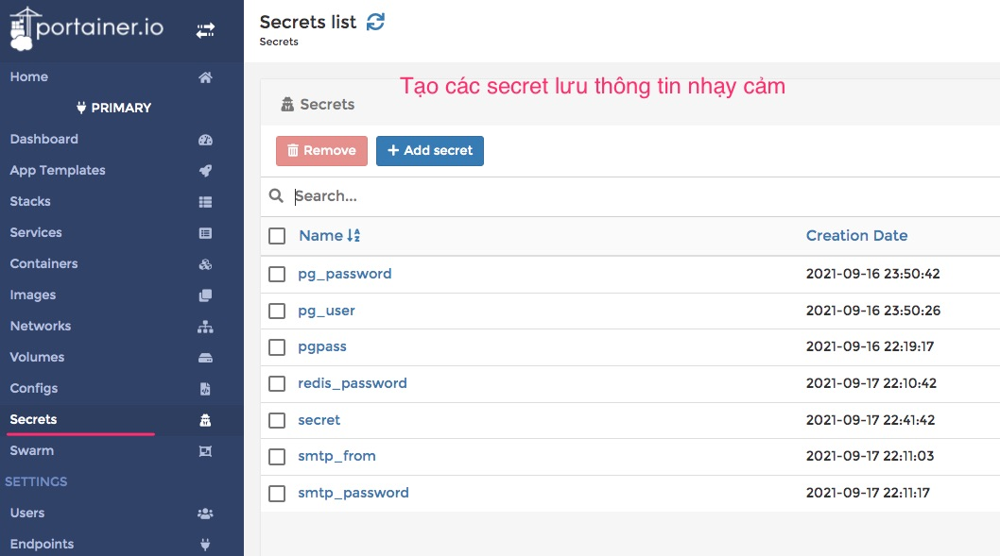
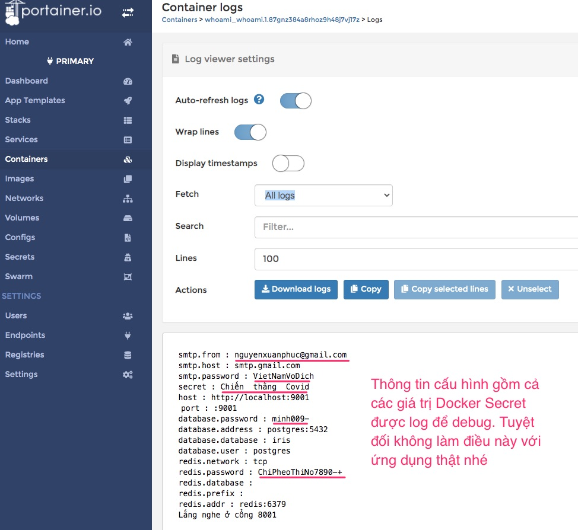
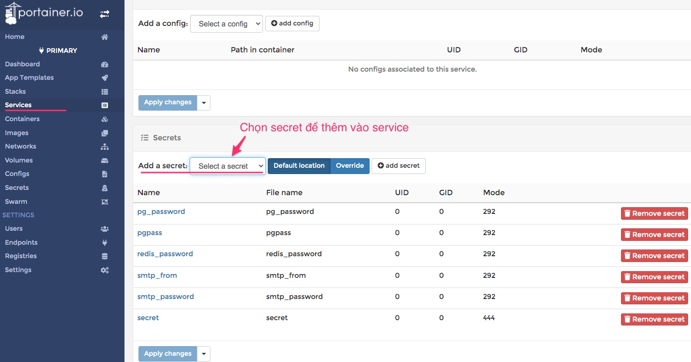

# Bảo mật password bằng Docker Secret

Những điều bạn cần biết về Docker Secret

1. Docker secret chỉ dùng được trong Docker Swarm
2. Docker secret không cần key gì để mã hoá cả. 
3. Docker secret khi được tạo ra thì service nào cũng có thể khai báo để dùng.
4. Khi service khai báo dùng secret: lúc docker container của service khởi động sẽ đọc nội dung secret rồi lưu vào thư mục `/run/secrets`. Toàn bộ nội dung secret được khi dạng plain text vào file có tên giống tên secret
5. Bạn không thể cập nhật được nội dung bên trong secret mà chỉ có thể xoá secret. Muốn xoá secret thì phải tạm gỡ nó ra khỏi các service đang khai báo dùng nó.
6. Dùng Docker secret ở những đâu?
   - Khai báo user, pass cho service database: MySQL, Postgresql, Redis
   - Khai báo user, pass kết nối database ở các dịch vụ web


## 1. Sử dụng Docker Secret trong ứng dụng Golang triển khai trong Docker Swarm

### 1.1 Vào Portainer định nghĩa các secret



### 1.2 Khai báo dùng Docker secret trong service
Xem file [dc_whoami.yml](src/dc_whoami.yml)
```yaml
version: "3.8"

networks: 
  techmaster:  # Khai báo sử dụng networks techmaster ở bên ngoài
    external: true

secrets:
  pgpass: 
    external: true
    
  pg_password: 
    external: true
  redis_password:
    external: true
  secret:
    external: true
  smtp_from:
    external: true
  smtp_password:
    external: true

services:
  whoami:
    image: "manager02:5000/main:latest"
    networks: 
      - techmaster  #Join to traefik network
    secrets:
      - pgpass
      - pg_password
      - redis_password
      - secret
      - smtp_from
      - smtp_password
    deploy:
      labels:
        - "traefik.enable=true"
        - "traefik.http.routers.whoami.rule=Host(`techmaster.com`) && PathPrefix(`/whoami`)"
        - "traefik.docker.network=techmaster"
        - "traefik.http.routers.whoami.entrypoints=web"
        - "traefik.http.services.whoami.loadbalancer.server.port=8001"
        - "traefik.http.routers.whoami.service=whoami"
```

### 1.3 Cấu hình file json trong dự án Golang
Rồi vào dự án [src/websites/main](src/websites/main) xem file [config.product.json](src/websites/main/config.product.json):

```json
{
    "host": "http://localhost:9001",
    "port": ":9001",
    "secret": "@@secret", 
    "database": {
        "user": "postgres",
        "password": "@@pg_password", 
        "database": "iris",
        "address": "postgres:5432"
```

Những giá trị nào bắt đầu bằng 2 ký tự `@@` có nghĩa là sẽ đọc giá trị lưu ở file 
trong thư mục `/run/secrets/`



## 2. Sử dụng Docker Secret cho Postgresql, Redis database

Hãy xem bài viết này của thầy Thưởng [Best Practice: Triển khai hệ thống sử dụng Docker Secret](https://thuongnn.notion.site/Best-Practice-Tri-n-khai-h-th-ng-s-d-ng-Docker-Secret-68cd07826af245ebba9cdf9eed46053d)

## 3. Đổi giá trị trong Docker Secret như thế nào?

Giá sử cần phải đổi pass vào Postgresql database.

1. Vào từng service đang dùng Docker secret, gỡ bỏ tạm thời Docker secret ra
2. Xoá Docker secret
3. Tạo mới Docker secret trùng tên với Docker secret vừa xoá nhưng mang giá trị mới
4. Lại vào từng service thêm lại secret vào



## 4. Lỗ hổng bảo mật với Docker Secret

1. Nếu bị mất quyền truy cập vào Portainer thì hacker có thể exec vào console của Container sau đó vào thư mục `/run/secrets` để xem từng giá trị thật của Docker secret. Do đó bảo mật Portainer bằng pass đủ dài, thường xuyên đổi pass là rất quan trọng.
2. Tuyệt đối không map volume vào thư mục `/run/secrets` của container.
3. Cẩn trọng với các Golang package có thể đọc trộm vào `/run/secrets` rồi gửi thông tin ra ngoài.