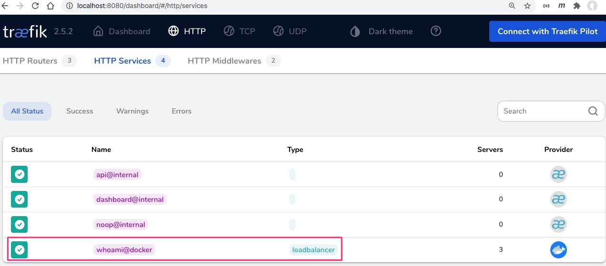
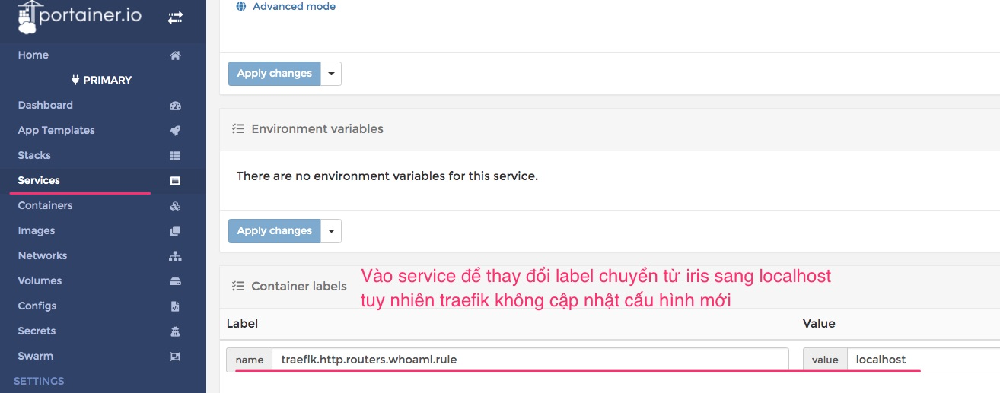

## Traefik kết hợp Docker Swarm

## Tham khảo

1. [Integrate Traefik 2.1 Reverse Proxy with Docker Swarm Services](https://betterprogramming.pub/traefik-2-1-as-a-reverse-proxy-c9e274da0a32?gi=504ed06a6ca3)
2. [https://github.com/wshihadeh/traefik_v2](https://github.com/wshihadeh/traefik_v2)
  
## 1. Traefik + Whoami

```yaml
version: '3'

services:
  gateway:
    image: traefik:v2.5
    command:
      - '--api.dashboard=true'
      - '--api.insecure=true'
      - '--providers.docker=true'
      - '--entryPoints.web.address=:80'
      - '--providers.docker.watch=true'
      - '--providers.docker.swarmMode=true'
      - '--providers.docker.swarmModeRefreshSeconds=15s'
    ports:      
      - "80:80"
      - "8080:8080"
    volumes:
      - /var/run/docker.sock:/var/run/docker.sock:ro
    deploy:
      placement:
        constraints:
          - node.role == manager
          - node.hostname == manager01

  whoami:
    image: traefik/whoami
    deploy:
      labels:
        - "traefik.http.routers.whoami.rule=Host(`iris.com`)"
        - "traefik.http.services.whoami.loadbalancer.server.port=80"
        - "traefik.http.routers.whoami.service=whoami"
```

Tạo record trong /etc/hosts ở máy host
```
127.0.0.1 iris.com
```




Thử thay đổi cấu hình label từ `iris.com` sang `localhost` nhưng Traefik không cập nhật lại
```yaml
  whoami:
    image: traefik/whoami
    deploy:
      labels:
        - "traefik.http.routers.whoami.rule=Host(`iris.com`)"
```


## 2. Cấu hình Traefik tự động cập nhật
Traefik + Docker Swarm chưa hỗ trợ đồng thời Docker Provider và Dynamic File

Tuy nhiên khi cập nhật `docker-compose.yml` như đổi
```yaml
whoami:
  image: traefik/whoami
  deploy:
    labels:
      - "traefik.enable=true"
      - "traefik.http.routers.whoami.rule=Host(`localhost`)"
```

thành
```yaml
whoami:
  image: traefik/whoami
  deploy:
    labels:
      - "traefik.enable=true"
      - "traefik.http.routers.whoami.rule=Host(`iris.com`)"
```

Sau đó update lại stack bằng lệnh

```
$ docker stack deploy -c docker-compose.yml traefik
```


## 3. Traefik + LetsEncrypt
https://www.robert-jensen.dk/posts/2021-secure-deployments-with-docker-and-traefik/