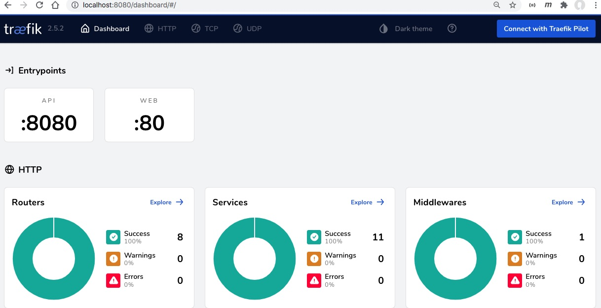

# Mô tả các bước triển khai hệ thống đầy đủ

## 0. Cần chuẩn bị môi trường
Vagrant với 3 máy ảo: `manager01`, `manager02`, `manager03`.

Riêng máy ảo `manager01` cần tăng thêm RAM vì nó sẽ dùng để build docker image
```yaml
if i == 1  # Server Manager đầu tiên của Docker Swarm
    manager.vm.provider PROVIDER do |pmv|
      pmv.memory = 4096
    end           
    manager.vm.network :forwarded_port, guest: 80, host: 80 # Web
    manager.vm.network :forwarded_port, guest: 8080, host: 8080 # Traefik Dashboard            
    manager.vm.network :forwarded_port, guest: 443, host: 443 # SSL
    manager.vm.network :forwarded_port, guest: 9000, host: 9000 # Portainer
    manager.vm.network :forwarded_port, guest: 8000, host: 8000 #
    manager.vm.network :forwarded_port, guest: 8001, host: 8001
    manager.vm.network :forwarded_port, guest: 8002, host: 8002            
    manager.vm.network :forwarded_port, guest: 5432, host: 5432 # Postgresql
    manager.vm.network :forwarded_port, guest: 6379, host: 6379 # Redis
end
```

#### Chuẩn bị tối thiểu 2 overlay network `techmaster` và `techmaster_backend`


## 1. Traefik Gateway
Triển khai traefik gateway bắt buộc phải ở manager01 vì chỉ có manager01 mới có mapping port 80, 8080 ra ngoài host
```
v ssh manager01
cd /src
docker stack deploy -c dc_traefik.yml traefik
```
Khởi động xong vào http://localhost:8080 login với cuong/minh009-


## 2. Docker Registry và Registry UI

- Dịch vụ `registry` để lưu các docker image
- Dịch vụ `registryui` để liệt kê danh sách các docker image mà dịch vụ `registry` đang lưu

Triển khai stack registry
```
cd /src
docker stack deploy -c dc_registry.yml registry`
```

Xem file [src/dc_registry.yml](src/dc_registry.yml). Chú ý registryui tham gia vào 2 mạng:
- Mạng nội bộ `registry_net` cùng với registry để đọc danh sách các Docker image
- Mạng overlay `techmaster`

Trong cấu hình của service `registryui` cần ghi rõ
```yaml
deploy:
  placement:
    constraints: 
      - node.hostname == manager02  # Chỉ triển khai trên manager02
  labels:
    - "traefik.enable=true"
    - "traefik.http.routers.registryui.rule=Host(`registry.techmaster.com`)"
    - traefik.docker.network=techmaster # Sử dụng mạng techmaster mới thông được với traefik gateway
```

Ngoài ra registry ui còn được bảo vệ bởi basic auth: cuong/minh009-
```yaml
deploy:
  labels:
    - "traefik.http.routers.registryui.middlewares=auth"
    - "traefik.http.middlewares.auth.basicauth.users=cuong:$$2y$$10$$A6vuYpsxe.NPH2wHtPdflOgDjHGScxSbrq0YqKgmJ3E8HmS7kzWVC"
```


## 3. Triển khai nhiều web site để quản lý trong traefik
Việc đầu tiên cần phải build được các docker image trên máy ảo `manager01`. Trong [Vagrantfile](Vagrantfile) máy ảo này cũng được cấu hình nhiều RAM hơn.

SSH vào `manager01` chạy lệnh build tất cả các Docker image của web sites rồi push lên `manager02:5000`
```
vagrant ssh manager01
cd /src/big
make build
```
Cấu trúc thư mục [/src/big](src/big) như sau:
```
├── admin
├── main
├── media
├── teacher
├── user
├── video
├── Makefile
└── ReadMe.md
```

Tiếp đó deploy stack các web sites. Chú ý ở 3 máy ảo `manager01`, `manager02` và `manager03` cần chỉnh file `/etc/hosts` để nó có DNS record `192.168.33.3 manager02`. Cấu hình này sẽ giúp docker ở các máy ảo có thể kết nối vào `manager02:5000` để tải về Docker image

```
docker stack deploy -c dc_big.yml websites
```

Xem file [src/dc_big.yml](src/dc_big.yml). Quy tắc routing như sau
1. http://techmaster.com --> main port 8001
2. http://techmaster.com/blog --> main port 8001
3. http://techmaster.com/admin --> admin port 8002
4. http://techmaster.com/teacher --> teacher port 8003
5. http://techmaster.com/user --> user port 8004
6. http://techmaster.com/video --> video port 8005
7. http://techmaster.com/media --> media port 8006

Cần phải chia ra 2 loại network để tăng tính bảo mật, giảm việc routing lòng vòng
```yaml
networks: 
  techmaster:  # Khai báo sử dụng networks techmaster ở bên ngoài
      external: true
  techmaster_backend:  # Khai báo sử dụng networks techmaster ở bên ngoài
      external: true
```

1. `techmaster` dùng để nối traefik với các web sites
2. `techmaster_backend` dùng để các web sites kết nối vào CSDL back end như Postgresql, Redis, TaskQueue...
Việc phân cụm Stack cần hợp lý thì sau mới dễ bảo trì, quản lý


**Nên chia stack ra các nhóm sau đây:**
1. `portainer` gồm porainerui và các agent
2. `registry` gồm registry + registryui
3. `websites` gồm các trang web nghiệp vụ
4. `postgresql` gồm database Postgresql master + slave hỗ trợ failed over và Pgadmin
5. `redis` gồm redis master-slave + sentinel để hỗ trợ failed over
6. `landing` gồm toàn các trang landing pages tĩnh
7. `beta` gồm các dịch vụ đang thử nghiệm

Đây là giao diện Swarm Visual Cluster


Đây là Traefik Dashboard


Danh sách các dịch vụ được quản lý bởi Traefik


## 4. Hệ thống có gặp vấn đề routing không?

Hoàn toàn không!

Ở máy chủ ngoài cùng cấu hình file `/etc/hosts` như sau:
```
127.0.0.1 manager02
127.0.0.1 techmaster.com
127.0.0.1 registry.techmaster.com
```

Trang main gồm có đường dẫn http://techmaster.com và http://techmaster.com/blog route rất nhanh, hoàn toàn không có biểu hiện bị lag

## 5. Kiểm thử tải cho vui

Đường dẫn `http://techmaster.com/blog` chỉ trả về duy nhất một dòng. Cơ bản nó là web site tối giản
```
$ curl http://techmaster.com/blog
This is blog in main site
```

Hãy tạo ra các request để kiểm thử tải
```
hey -n 10000 -c 100 http://techmaster.com/blog
```
**Kết quả như sau**
```
Summary:
  Total:	4.6649 secs
  Slowest:	0.2070 secs
  Fastest:	0.0016 secs
  Average:	0.0452 secs
  Requests/sec:	2143.6605

  Total data:	247900 bytes
  Size/request:	25 bytes

Response time histogram:
  0.002 [1]	|
  0.022 [2697]	|■■■■■■■■■■■■■■■■■■■■■■■■■■■■■■■■■■■■■■■■
  0.043 [2524]	|■■■■■■■■■■■■■■■■■■■■■■■■■■■■■■■■■■■■■
  0.063 [2216]	|■■■■■■■■■■■■■■■■■■■■■■■■■■■■■■■■■
  0.084 [1340]	|■■■■■■■■■■■■■■■■■■■■
  0.104 [660]	|■■■■■■■■■■
  0.125 [298]	|■■■■
  0.145 [129]	|■■
  0.166 [43]	|■
  0.186 [7]	|
  0.207 [1]	|
```

Việc thử tải trên một laptop không có ý nghĩa nhiều lắm. Tuy nhiên nó giúp ta biết được phần resolve DNS, routing của Traefik là ok.

**Traefik debug log làm chậm tốc độ đi rất nhiều**


Tốc độ định tuyến của Traefik nhanh hơn gấp 2 khi không ghi log

```
Summary:
  Total:	2.0564 secs
  Slowest:	0.0691 secs
  Fastest:	0.0013 secs
  Average:	0.0202 secs
  Requests/sec:	4862.8784
```

```yaml
services:
  gateway:
    image: traefik:v2.5
    networks: 
      - techmaster
    command:
      - '--log.level=DEBUG'  # Hãy loại bỏ dòng này sau khi Traefik đã chạy ổn định !
```